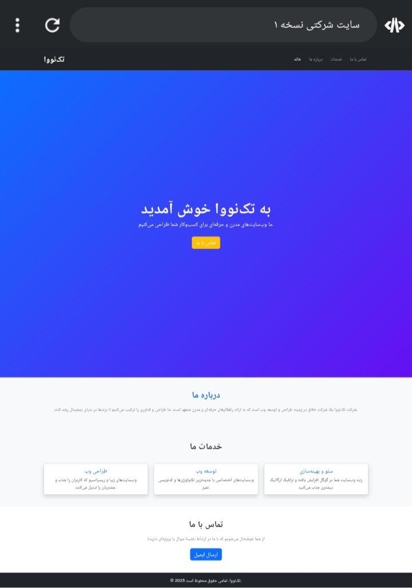

# Company Website V1

## Overview
Responsive company website built with HTML, CSS, and JavaScript. Features smooth scrolling, animated sections, and modern UI design.

## Features
- Fully responsive design for desktop and mobile
- Smooth scrolling navigation
- Animated section fade-ins
- Contact form with validation
- Clean and modern layout

## Technologies Used
- HTML5
- CSS3
- JavaScript
- Bootstrap 5 (optional)

## Screenshots


## How to Use
1. Clone the repository
```bash
git clone https://github.com/farhad-dev84/company-website-v1.git
